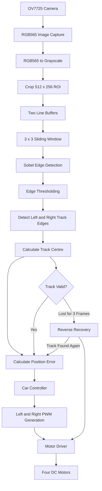

_____________________________________
Equipment preparation

For this project, I used an FPGA development board with an EP4CE10F17C8 chip and a 50 MHz crystal oscillator. I also prepared two acrylic boards, an OV7725 camera, four motors, a 7.8 V power supply for the motors, a 12 V power supply for the FPGA board, a J-Link programmer, some jumper wires and screws. I used Quartus Prime to write and compile the Verilog code.

_____________________________________
System Flow

_____________________________________
Project idea

In my second year, I made a line-following car using an Arduino board and infrared sensors. The sensors sent infrared light to the track and checked the difference between the reflected light from the black and white parts, so the car could tell whether it was following the line correctly. After learning FPGA, I wanted to try the same type of project again but replace the Arduino with an FPGA. I found that FPGA has good parallel processing and accurate timing control, which could be useful for image processing. I also wanted to replace the infrared sensors with a camera because the camera can see farther and collect more information from the track. I had learnt some machine learning and deep learning by myself before and knew the basic idea of convolution kernels. So I thought using Sobel edge detection to find the track edges would be more useful than processing the whole colour image directly. My idea was to combine the camera with FPGA real-time processing and use the detected edges to control the car.

At the beginning, I was not very familiar with how the OV7725 works, so I found some open-source code for the camera driver and data collection. It uses I2C communication and an eight-state finite state machine for the camera register operation. After reading the code, I found that the camera data is combined into 16-bit RGB565 pixels. If I directly used RGB565 for Sobel, I would need to process the R, G and B channels separately and they could give different edge results. So I decided to convert the image into grayscale first. I expanded the three RGB values to 8 bits and calculated the grayscale value using Y = 0.28125R + 0.5625G + 0.125B. Then I sent gray_out together with valid_out to the Sobel part.

The original camera image is 640 x 480. I thought processing the whole image would use too many FPGA resources, so I only kept a 512 x 256 area from the lower-middle part, which is pixels 64-575 and 224-479. I did not make the width too small because if the car moves too far from the centre, one of the track edges may move outside the processing area. I chose the lower part because this part of the track is closer to the camera and has less perspective error. Also, because of the way I fixed the camera, the farther part looked slightly curved, so I tried to remove the part with more error.

The Sobel calculation needs a 3 x 3 window, which means I needed three rows of pixels at the same time. I used the idea of FIFO and made two line_buffer modules to save the previous two rows. When the input is valid, on each rising clock edge the old value is read out and the new pixel is written in. After the first row is filled, I can input a new pixel and get the corresponding pixel from the previous row at the same time. I connected two line buffers together so three rows could match on the same clock edge. Then I made a 3 x 3 sliding window. The newest value goes into C, the old C moves to B and the old B moves to A. In this way, the window moves one pixel on every clock cycle. I stored the three rows as GHI, DEF and ABC and did one Sobel calculation each time the window moved. For the final edge value, I calculated the horizontal and vertical gradients and added their absolute values together. After the 3 x 3 operation, the 512 x 256 image becomes 510 x 254 because the outside pixels cannot be the centre of the window.

After I got the Sobel image, the next thing I needed to do was find the track. I changed the result into a binary image and set the threshold to 100. If the value is higher than 100, I treat it as an edge; otherwise, I set it to 0. This helped me remove some noise and keep the stronger edges. For each row, I find the leftmost and rightmost valid edge points and add them together then divide by 2 to get the centre of that row. I also read several valid rows and calculate an average centre for the car. Then I compare this value with my target centre.

One problem was that I could not fix the camera exactly in the middle of the car, so I could not simply use the middle pixel of the image as the target centre. I found some open-source OV7725 HDMI code and added my Sobel part to it. Then I connected the HDMI output to a TV, put the car in the middle of the track and looked at the positions of the two track edges on the screen. From the image width, the Sobel area and the offset of the two edges, I estimated a target centre value. This was not very accurate, but at that time I could not get the exact pixel position of the real track centre, so I used this value for my testing.

When the car is moving, I calculate the error by current centre - target centre. If the result is positive, the car is too far to the right, so it needs to turn left. If it is negative, it needs to turn right. The wheels cannot turn direction by themselves, so I control the direction by changing the speed difference between the left and right motors. I changed the PWM duty cycle to control the motor speed. I found that because the friction of the car is quite large, the duty cycle needs to be above about 200/1000 before the car can move. However, if I make it too fast, the car can easily leave the track, so I had to find a suitable speed. I also added a recovery part. If the car cannot find valid edge data for three frames, I make it reverse at a fixed speed to try to find the track again. When it reads valid edge data for three frames, it goes back to the line-following part. At the moment, the car can read the track edges, adjust the left and right motor speeds when it moves away from the centre, reverse when it loses the track and then continue following a straight line.

_____________________________________
Using knowledge

1.Camera Driver and Data Acquisition
1) I wrote the camera part in Verilog and worked with an I2C finite state machine to configure the OV7725 and read the image data.
2) From this part, I also learnt how the RGB565 pixel data is put together and passed to the next module.

2.Digital Image Processing
1) I converted the RGB565 data into grayscale first, so I only needed one brightness value for the Sobel part.
2) I sent the pixel data with the valid signal to keep the data matched between different modules.

3.Sobel Edge Detection
1) I made two line buffers to save the previous rows and then built a 3 x 3 sliding window for the Sobel calculation.
2) For the edge result, I calculated the horizontal and vertical gradients and added their absolute values together.

4.Track Recognition
1) I set a threshold for the Sobel result to remove some noise and keep the stronger edge points.
2) Then I found the left and right edges, calculated their centre and compared it with the target centre.

5.Motion Control
1) I controlled the motor speed with PWM and changed the speed difference between the left and right motors to turn the car.
2) I calculated the position error from the camera result and changed the two motor speeds based on whether the car was on the left or right.

_____________________________________
Problem and solving

One problem I had was finding the correct target centre. Because of the way I fixed the camera, it was not exactly in the middle of the car, so the middle of the image was not the real track centre. At first I thought I could estimate it directly from the image size, but the camera position made the result inaccurate. So I found some open-source OV7725 HDMI code and added my Sobel part to it. I connected the HDMI output to a TV, put the car in the middle of the track and checked where the two track edges appeared on the screen. Then I used their positions and the image offset to estimate the target centre. The value was not exact, but after using it in the control part, the car could correct its direction around the centre of the straight track, so I kept it for my current design.

____________________________________
Expansion

There are still a few things I want to improve in this project:

1.The real centre for line following still needs to be more accurate. I could fix the camera in the middle of the car, or read the edge points in real time and calculate an average track centre.

2.I also need to find a better duty cycle for the motors, so the car can move smoothly without getting stuck but is not too fast and easy to run out of the track.

3.I want to reduce the noise and make sure the detected edges are the real track edges. For example, I could clean the track or add more conditions for valid edges, such as checking that nearby edge points are not too far apart. If I move the car to another environment, the binary threshold may also need to change because the lighting and background will be different.

4.I could add a Wi-Fi or other communication module later, so the car can send data to a phone or computer.

